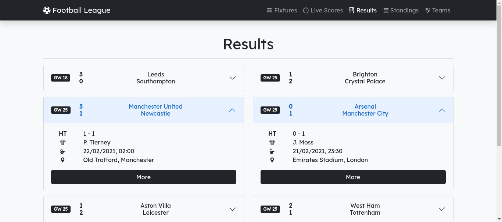
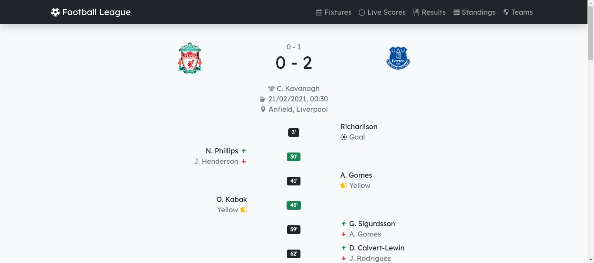
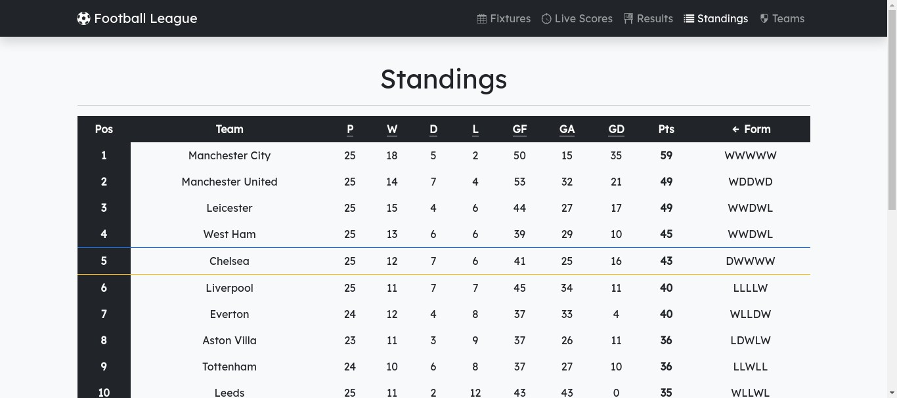
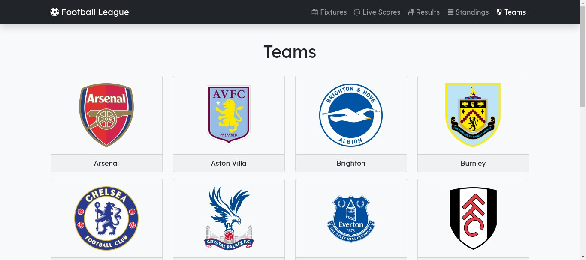
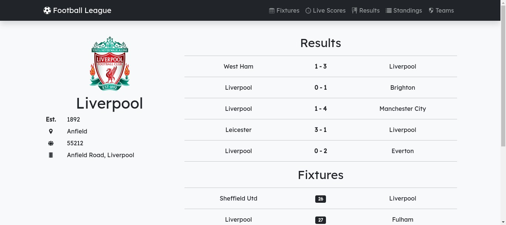

# Football League

Kode sumber untuk situs web bertema Liga Sepak Bola.

Fitur:

- Jadwal
- _Livescore_
- Hasil
- Klasemen
- Daftar Tim
- Detail Tim
- Detail Pertandingan

Dibangun menggunakan:

- HTML
- CSS
- JavaScript
- [Bootstrap 5](https://getbootstrap.com/)
- [axios](https://github.com/axios/axios)
- [API-Football](https://www.api-football.com/)
- [IcoFont](https://icofont.com/)

## Screenshots

Karena _API-Football_ memiliki batas pemanggilan API hanya sampai 100 panggilan per hari, saya memutuskan untuk tidak menyertakan demonya. Kamu bisa langsung mencobanya dengan mendaftar akun milikmu sendiri. Berikut beberapa tangkapan layar dari situs ini:











## Install

1. Unduh repositori ini.
2. Daftar akun di [API-Football](https://dashboard.api-football.com/) lalu ambil _API key_ di **Dashboard** > **Account** > **My Access**.
3. Buat berkas **config.js** di **js/apis** lalu isi dengan kode berikut dan ubah **YOUR_API_KEY** dengan _API key_ milikmu:
```javascript
// Base API
const API_FOOTBALL = "https://v3.football.api-sports.io";
const API_KEY = {
  headers: {
    "x-apisports-key": "YOUR_API_KEY",
  },
};

// Query
const SEASON = 2020;
const LEAGUE = 39;
const RANGE = 10;

// Endpoints
const FIXTURES = `/fixtures?season=${SEASON}&league=${LEAGUE}&status=ns&next=${RANGE}`;
const LIVESCORES = `/fixtures?live=${LEAGUE}-0`;
// const LIVESCORES = `/fixtures?live=all`; // For testing
const RESULTS = `/fixtures?season=${SEASON}&league=${LEAGUE}&status=ft&last=${RANGE}`;
const STANDINGS = `/standings?season=${SEASON}&league=${LEAGUE}`;
const TEAMS = `/teams?season=${SEASON}&league=${LEAGUE}`;
const TEAM = `/teams?id=`;
const TEAM_FIXTURES = `/fixtures?season=${SEASON}&league=${LEAGUE}&team=`;
const MATCH = `/fixtures?id=`;

```
4. Jalankan.
5. Setiap halaman melakukan satu panggilan API, kecuali Detail Tim yang melakukan dua panggilan.

## License

[MIT License](./LICENSE)
